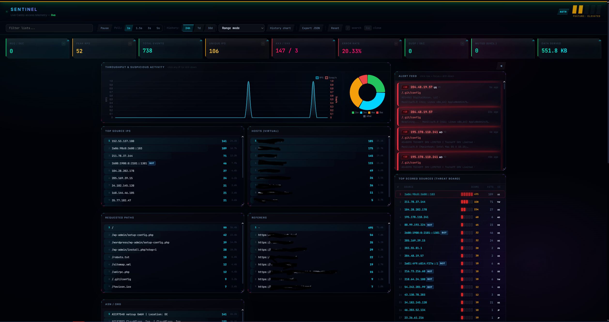
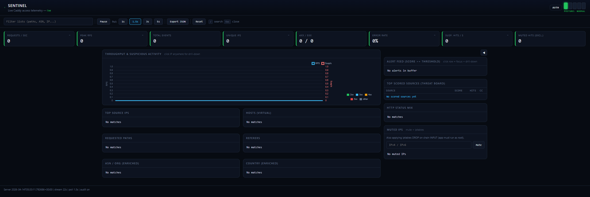

# Sentinel

Sentinel is a **SOC-style live dashboard** for a **Caddy JSON access log** and **SSH brute-force telemetry**. It tails log files locally and from remote agents, aggregates traffic, enriches IPs with ASN/country/reputation, scores noisy patterns, and serves a web UI plus JSON for scripting.



<details>
<summary>Previous UI (V1)</summary>



</details>

## Features

### HTTP Traffic Dashboard (`/`)
- **Live tail** of a JSON access log with rotation-safe binary reads
- **KPIs and charts**: RPS, peak RPS, status mix, top IPs, hosts, paths, referrers, ASN, country
- **Threat-style board**: scored sources, alert feed, IP drill-down with tag detail
- **Behavioral detection**: per-IP scan/bruteforce/error-probe signals and UA-rotation evasion detection
- **Session fingerprinting**: `ip|ua|accept|tls` clustering to spot shared-bot fingerprints across IPs
- **TLS/JA3 fingerprint correlation**: detects multiple IPs sharing a TLS cipher suite or Cloudflare JA3 fingerprint (`shared_tls_fp` tag)
- **Smarter botnet campaigns**: URI + UA + sequence + burst-timing confidence signals with detail modal
- **Historical telemetry**: local 30-day aggregates and event-level drilldown with per-day view; Referer and Host columns
- **Reputation enrichment**: background AbuseIPDB, GreyNoise, and Shodan (InternetDB) lookups for scored IPs
- **Mute list** with optional **iptables/ip6tables** DROP sync (`SENTINEL_IPTABLES`)
- **Geo** via [ip-api.com](http://ip-api.com) (async workers; cached)
- **Bot / crawler tags** from User-Agent heuristics (10+ tags: `scanner`, `bruteforce`, `error_probe`, `shared_ua`, `ua_rotation`, `server_error_probe`, `flood`, `headless`, `multi_host`, `empty_ua`, `persistent`, `shared_tls_fp`, `ua_burst`)
- **Optional HTTP Basic Auth** and append-only **audit** JSONL
- **Persistent state** via `SENTINEL_STATE_DIR` (`bans.json`, `audit.jsonl`, `parsed-state.json`, `behavior-state.json`, `history-buckets.json`, `history-events/`)
- **Runtime-tunable settings** via `GET/POST /api/settings` — tweak detection thresholds without restart
- Parses **Caddy access** lines mixed with other JSON in the same file; prefers real `http.log.access` / `handled request` shaped events

### SSH Attack Intelligence Dashboard (`/ssh`)
- **Fully separate dashboard** — SSH data never pollutes HTTP metrics, alerts, or history
- **KPIs**: total authentication failures, unique attacking IPs, unique usernames tried, top attacker hits and IP
- **Live attack rate chart** (180-second sliding window, 1.5s polling)
- **Top attacking IPs** table: hit count, threat score, country, ASN, tags, top username tried, unique usernames per IP
- **Most tried usernames** — ranked list of credentials attackers target
- **Alert feed** — high-score SSH events with username, IP, country, ASN
- **Historical telemetry** — per-event log with time, IP, username tried, country, score
- **Country and ASN breakdown** specific to SSH sources
- **Persistent state** — SSH counters, IPs, usernames, alerts, and history survive restarts alongside HTTP state

## Requirements

- Python 3.10+
- Packages: `flask`, `requests`

```bash
python -m venv venv
venv\Scripts\activate   # Windows
# source venv/bin/activate   # Linux/macOS
pip install flask requests
```

## Configuration

Environment variables (see `sentinel.env.example` for a full template):

| Variable | Purpose |
|----------|---------|
| `LOG_PATH` | Path to the Caddy **access** JSON log file (default `/var/log/caddy/all-access.log`) |
| `LOG_FROM_START` | If `1` / `true` / `yes` / `on` / `y`, replay the file from the beginning on each start |
| `SENTINEL_STATE_DIR` | Directory for durable data: `bans.json`, `audit.jsonl`, `parsed-state.json`, `behavior-state.json`, `history-buckets.json`, `history-events/` |
| `SENTINEL_BAN_LIST` | Override ban list path (default `{STATE_DIR}/bans.json`) |
| `SENTINEL_AUDIT_LOG` | Override audit JSONL path (default `{STATE_DIR}/audit.jsonl`) |
| `SENTINEL_AUDIT_DISABLE` | Set to `1` to disable auditing |
| `SENTINEL_IPTABLES` | Set to `1` to add/remove firewall DROP rules for muted IPs (Linux, needs privileges) |
| `SENTINEL_IPTABLES_CHAIN` | iptables chain name (default `INPUT`) |
| `SENTINEL_HISTORY_RETENTION_DAYS` | Retention for local historical state/events (default `30`) |
| `SENTINEL_HISTORY_MAX_SCAN` | Maximum historical event rows scanned per `/api/history/events` request (default `20000`) |
| `SENTINEL_AUTH_USER` / `SENTINEL_AUTH_PASSWORD` | If both set, protect all endpoints with HTTP Basic Auth (`GET /health` and `/api/ingest` stay open) |
| `SENTINEL_INGEST_KEY` | Bearer token for remote push agents — must match the key on each push/ingest script |
| `ABUSEIPDB_KEY` | AbuseIPDB API key for reputation enrichment |
| `GREYNOISE_KEY` | GreyNoise API key for reputation enrichment |
| `REPUTATION_ENRICH_THRESHOLD` | Min threat score to trigger reputation lookup (default `15`) |

The tail thread re-reads `LOG_PATH` and `LOG_FROM_START` from the environment when it starts, so systemd `EnvironmentFile` values apply correctly.

## Run

```bash
python sentinel_soc.py
```

Default listen: `0.0.0.0:5000`.

## Dashboard navigation

The top nav bar links the two dashboards:

- **HTTP Traffic** (`/`) — Caddy access log analysis
- **SSH Attacks** (`/ssh`) — SSH brute-force telemetry

---

## SSH ingestion

SSH authentication data comes from a dedicated lightweight agent (`sentinel_ssh_ingest.py`) that runs on any host where SSH is exposed. It reads failed login events and POSTs them to Sentinel's `/api/ingest` endpoint in Caddy JSON format.

### Modes

The script supports two input modes and auto-detects the right one:

| Mode | Source | When used |
|------|--------|-----------|
| `file` | Tails `/var/log/auth.log` (or `/var/log/secure` on RHEL) | auth.log present and `SSH_SOURCE` not set to `journal` |
| `journal` | Reads `journalctl -u sshd -u ssh -f -o json -n 0` | auth.log absent, or `SSH_SOURCE=journal` |

The `journal` mode is recommended for hosts with full disks where rsyslog is not writing to auth.log, or where you want to bypass the filesystem entirely.

### Environment variables

| Variable | Default | Purpose |
|----------|---------|---------|
| `SENTINEL_URL` | `http://localhost:5000/api/ingest` | Sentinel ingest endpoint |
| `SENTINEL_INGEST_KEY` | _(none)_ | Bearer token — must match `SENTINEL_INGEST_KEY` on the Sentinel host |
| `SSH_LOG_PATH` | `/var/log/auth.log` | auth.log path (file mode only) |
| `SSH_SOURCE` | _(auto)_ | Force `file` or `journal` mode |
| `SSH_FLUSH_INTERVAL` | `5` | Seconds between batch flushes (set to `1` for near-realtime) |

### Install on the Sentinel host

```bash
sudo cp sentinel_ssh_ingest.py /opt/sentinel/sentinel_ssh_ingest.py
sudo cp sentinel_ssh_ingest.service /etc/systemd/system/
```

Edit `/etc/systemd/system/sentinel_ssh_ingest.service` and set your ingest key and URL, then:

```bash
sudo systemctl daemon-reload
sudo systemctl enable --now sentinel_ssh_ingest
sudo journalctl -u sentinel_ssh_ingest -f
```

### Install on a remote host

Use `sentinel_ssh_ingest_remote.service` — it does not depend on `sentinel.service` and expects all config in `/opt/sentinel/.env`:

```bash
# On the remote host
sudo mkdir -p /opt/sentinel
sudo cp sentinel_ssh_ingest.py /opt/sentinel/sentinel_ssh_ingest.py
sudo cp sentinel_ssh_ingest_remote.service /etc/systemd/system/sentinel_ssh_ingest.service
```

Create `/opt/sentinel/.env`:

```bash
SENTINEL_URL=http://<sentinel-host>:5000/api/ingest
SENTINEL_INGEST_KEY=your-secret-key
SSH_FLUSH_INTERVAL=1
# Optional — force journal mode on full-disk hosts:
# SSH_SOURCE=journal
```

```bash
sudo systemctl daemon-reload
sudo systemctl enable --now sentinel_ssh_ingest
sudo journalctl -u sentinel_ssh_ingest -f
```

You should see lines like `[ssh-ingest] tailing /var/log/auth.log` or `[ssh-ingest] reading from journalctl` followed by periodic `flushed N events` confirmations.

### Sentinel host — enable ingest

`SENTINEL_INGEST_KEY` must be set on the Sentinel host and must match the value in each agent's env file:

```bash
# In /etc/sentinel/sentinel.env
SENTINEL_INGEST_KEY=your-secret-key
```

```bash
sudo systemctl restart sentinel
```

The `/api/ingest` endpoint is automatically excluded from Basic Auth so agents can reach it without browser credentials.

---

## Multi-source ingestion — remote Caddy push agent

`sentinel_push.py` tails a remote Caddy access log and POSTs NDJSON batches to `/api/ingest`. Install it on any server that runs Caddy but cannot share a log directory with the Sentinel host.

### Requirements (on the remote server)

```bash
pip install requests
```

### Install

```bash
sudo cp sentinel_push.py /opt/sentinel/sentinel_push.py
```

Create `/etc/systemd/system/sentinel-push.service`:

```ini
[Unit]
Description=Sentinel log push agent
After=network.target

[Service]
ExecStart=/usr/bin/python3 /opt/sentinel/sentinel_push.py
Environment="PUSH_LOG_PATH=/var/log/caddy/access.log"
Environment="SENTINEL_URL=http://<sentinel-host>:5000/api/ingest"
Environment="SENTINEL_INGEST_KEY=your-secret-key"
Restart=always
RestartSec=5

[Install]
WantedBy=multi-user.target
```

```bash
sudo systemctl daemon-reload
sudo systemctl enable --now sentinel-push
sudo journalctl -u sentinel-push -f
```

### Environment variables

| Variable | Default | Purpose |
|----------|---------|---------|
| `PUSH_LOG_PATH` | `/var/log/caddy/access.log` | Log file to tail |
| `SENTINEL_URL` | `http://localhost:5000/api/ingest` | Sentinel ingest endpoint |
| `SENTINEL_INGEST_KEY` | _(none)_ | Bearer token — must match `SENTINEL_INGEST_KEY` on the Sentinel host |
| `PUSH_SOURCE` | hostname | Label shown in the Sentinel Log Sources card |
| `PUSH_BATCH` | `50` | Max lines per POST |
| `PUSH_INTERVAL` | `2` | Seconds to wait when no new lines are available |

---

## Runtime settings

Detection thresholds and behavioral tuning can be adjusted at runtime without restarting Sentinel:

```bash
# View current settings
curl http://localhost:5000/api/settings

# Change a threshold
curl -X POST http://localhost:5000/api/settings \
  -H 'Content-Type: application/json' \
  -d '{"SCORE_ALERT_THRESHOLD": 20}'
```

Tunable settings include scan/bruteforce/error-probe hit thresholds, botnet confidence levels, TLS fingerprint sharing threshold, UA burst window/threshold, reputation enrichment threshold, and persistent-threat day count.

---

## Behavioral detection tags

Each IP accumulates tags from behavioral signals. Tags appear on the IP drill-down and in alert rows.

| Tag | Signal |
|-----|--------|
| `scanner` | Rapid distinct path probing |
| `bruteforce` | Repeated login/auth failures |
| `error_probe` | High 4xx/5xx rate |
| `shared_ua` | Same User-Agent shared across many IPs |
| `ua_rotation` | IP rotates through multiple distinct UAs |
| `server_error_probe` | Triggers 5xx responses at high rate |
| `flood` | Extremely high request rate from single IP |
| `headless` | Headless browser / automation UA detected |
| `multi_host` | Requests to many distinct virtual hosts |
| `empty_ua` | Requests with blank or missing User-Agent |
| `persistent` | IP observed across multiple calendar days |
| `shared_tls_fp` | TLS cipher suite or JA3 fingerprint shared with other attacking IPs |
| `ua_burst` | Same UA appears across a large burst of distinct IPs in a short window |

---

## Synthetic test generator

Use `sentinel_testgen.py` to append realistic bogus access events to your Caddy access log and exercise behavioral detections, fingerprint clustering, botnet burst correlation, and historical storage.

```bash
# Write synthetic events into your live access log
python sentinel_testgen.py --log-path /var/log/caddy/all-access.log --events 2500 --burst-events 500

# Verify Sentinel endpoints after generation
python sentinel_testgen.py --log-path /var/log/caddy/all-access.log --events 1500 --verify-url http://127.0.0.1:5000

# Spread events across time windows
python sentinel_testgen.py --log-path /var/log/caddy/all-access.log --events 1200 --delay-ms 5
```

---

## systemd

Example unit: `sentinel.service` (adjust `WorkingDirectory`, `ExecStart`, and `ReadWritePaths` for your layout).

- Install env file: copy `sentinel.env.example` to `/etc/sentinel/sentinel.env`, restrict permissions (`chmod 600`), set secrets.
- With `ProtectSystem=strict`, every directory you **write** (app dir, `SENTINEL_STATE_DIR`, Caddy log read path, audit path) must be listed in `ReadWritePaths`.

---

## Caddy

- Point `LOG_PATH` at the file your **sites** actually log to. If that file is mostly `admin.api` / startup noise, split logging so **access** lines use a dedicated logger (e.g. `http.log.access`).
- Behind **Cloudflare**, configure Caddy **`trusted_proxies`** and **`client_ip_headers`** so logs reflect the visitor. Sentinel prefers **`Cf-Connecting-Ip`**, then **`client_ip`**, then **`X-Forwarded-For`**, before falling back to **`remote_ip`**.

Reference Caddyfile snippets: `caddy-recommended.caddyfile`.

---

## HTTP API

| Method | Path | Notes |
|--------|------|--------|
| GET | `/` | HTTP Traffic dashboard UI |
| GET | `/ssh` | SSH Attack Intelligence dashboard UI |
| GET | `/data` | Full JSON snapshot for the HTTP dashboard |
| GET | `/api/ssh/data` | Full JSON snapshot for the SSH dashboard |
| GET | `/health` | Plain `ok` (no auth) |
| GET | `/api/ip?ip=…` | Per-IP drill-down (paths, geo, tags, behavior) |
| GET | `/api/history/series` | Aggregated history (`from`, `to`, `bucket`, optional `day`) |
| GET | `/api/history/events` | Event drilldown (`from`, `to`, `page`, `page_size`, filters, optional `day`) |
| GET | `/api/history/days` | Available locally saved days with day-level totals |
| GET | `/api/settings` | View current runtime detection thresholds |
| POST | `/api/settings` | Update one or more runtime thresholds (JSON body) |
| GET | `/api/storage` | Disk usage for `SENTINEL_STATE_DIR` |
| POST | `/api/ban` | JSON body `{"ip":"…"}` or `?ip=` — mute IP or CIDR block |
| POST | `/api/unban` | Unmute IP or CIDR block |
| POST | `/api/reset` | Clear all in-memory metrics including SSH state (tail keeps running) |
| POST | `/api/ingest` | Receive NDJSON batches from push agents (Bearer auth via `SENTINEL_INGEST_KEY`) |
| POST | `/api/tls_fp/delete` | Remove a TLS fingerprint group from tracking |

When Basic Auth is enabled, failed attempts are audited (if auditing is on). `/api/ingest` is always excluded from Basic Auth.

---

## Troubleshooting

- **`journalctl -u sentinel`** should show lines like `log tail path=…` and `log opened … size=…`. If the log cannot be opened, fix permissions or `ReadWritePaths`.
- **`/data`** includes `log_path`, `log_from_start`, `stream_parse_debug`, `state_dir`, `ban_list_path`, `parsed_state_path`, `audit_path` for quick checks.
- **Read-only audit path** under systemd hardening: use `SENTINEL_STATE_DIR` under a writable path, or add the audit directory to `ReadWritePaths`, or remove a bad `SENTINEL_AUDIT_LOG` override.
- **SSH ingest 401**: confirm `SENTINEL_INGEST_KEY` matches on both the Sentinel host and the ingest agent's env file. The key in `/etc/sentinel/sentinel.env` and `/opt/sentinel/.env` must be identical.
- **SSH ingest not receiving data / disk full**: set `SSH_SOURCE=journal` to bypass auth.log and rsyslog entirely. The journal mode reads directly from systemd and is unaffected by disk pressure on `/var/log`.
- **SSH data not appearing on dashboard**: check `journalctl -u sentinel_ssh_ingest -f` for `flushed N events` lines. If you see `POST failed 401`, the ingest key is mismatched. If you see `timed out`, the Sentinel host may be slow — increase `SSH_FLUSH_INTERVAL` or check disk on the Sentinel host.

## Optional: GoAccess

`caddy-goaccess-report.sh` is a helper pipeline (jq + GoAccess) for static HTML reports; adjust paths inside the script for your host.

## License

MIT — free to use, modify, and distribute. See [LICENSE](LICENSE).
